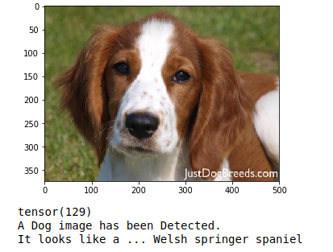
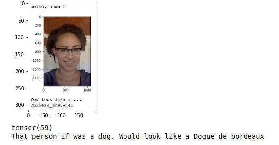
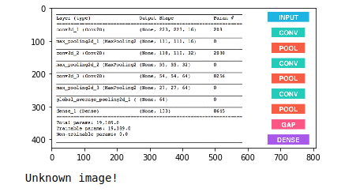

## Introduction

The automatic classification of images is a fascinating problem; the objective is to generate a fully automated process to add metadata to digital images to group them based on common features; the process is also known as automatic image annotation. This kind of classification tasks were usually assigned to human experts. But, with the advent of new and more powerful technologies like machine learning, deep learning, and the almost infinite computer power provided by cloud computing, we can automate these processes in a scalable way.

One field of interest is the classification of dog breeds; the Fédération Cynologique Internationale officially recognizes 360 breeds. However, for non-specialized
people can be somewhat difficult to distinguish one from another. Having an automatic application to classify a dog by their breed can potentially predict if it is or nota pure breed and can help identify his ancestry. One interesting thing about data analysis and classification using AI is that it can uncover relationships or causation. For example, by analyzing the picture of a dog, we can infer their ancestry or breed and predict how easy or hard to train is.

### Overview

Convolutional Neural Networks (CNN or ConvNet) are used for image classification and recognition because of its high accuracy. It was proposed by computer scientist Yann LeCun in the late 90s, when he was inspired from the human visual perception of recognizing things. These are complex feed forward neural networks.  The CNN architecture follows a hierarchical model which works on building a network, like a funnel, and finally gives out a fully-connected layer where all the neurons are connected to each other and the output is processed.

The goals of this article are: Explain the process of image classification using CNNs to identify the breed of a dog based on their picture, use similar techniques to differentiate human and dog pictures and compare different solution approaches. 

* Step 1: Import the datasets into the Jupyter environment.
* Step 2: Implement human image recognition.
* Step 3: Implement dog image recognition.
* Step 4: Create a CNN from scratch, and train, validate and test that model.
* Step 5: Create a CNN to classify dog breeds using transfer learning.
* Step 6: Implement an algorithm combining those models.
* Step 7: Evaluate the following test cases:
    * If a human is detected, return a resembling dog breed.
    * If a dog photo is detected, return their breed.
    * If the image cannot be classified, return an error.

### 1. Import the datasets into the Jupyter environment.

We will be using two datasets of images, the first one filled with dog images and the second one with people photos. The objective is to not only classify dog breeds but differentiate between persons and pets. Udacity provided the human dataset. While it shows their real names and faces, they are from public figures and easily available to anyone to avoid privacy concerns.

* [Dog dataset] (https://s3-us-west-1.amazonaws.com/udacity-aind/dog-project/dogImages.zip)  8351 images (train: 6680, test: 836, valid: 835) It has 133 folders for each of the dog breeds, the pictures have different height and width, so to use this data in training, we should normalize the data resizing the images to the same dimensions. Analyzing the data shows that the data distribution is not balanced by labels.

* [Human dataset] (https://s3-us-west-1.amazonaws.com/udacity-aind/dog-project/lfw.zip) 13234 images. Each of the images has the same 250x250 size; this set's data is also not balanced since there are labels(persons) with a single photo while others have many.

* Also there would be a haarcascades folder which stores a ML-based approach where a cascade function is trained from a lot of positive and negative images, and used to detect objects in other images. The algorithm uses the Haar frontal face to detect humans. So the expectation is that an image with the frontal features clearly defined is required.

* Included also is a small test set of images to make the final test of the model, inside the sample_images folder

### 2. Implement human image recognition.

In this section, we use OpenCV's implementation of Haar feature-based cascade classifiers to detect human faces in images.

OpenCV provides many pre-trained face detectors, stored as XML files on github. We have downloaded one of these detectors and stored it in the haarcascades directory. In the next code cell, we demonstrate how to use this detector to find human faces in a sample image.

```python
import cv2                
import matplotlib.pyplot as plt                        
%matplotlib inline                               

# extract pre-trained face detector
face_cascade = cv2.CascadeClassifier('haarcascades/haarcascade_frontalface_alt.xml')

# load color (BGR) image
img = cv2.imread(human_files[0])
# convert BGR image to grayscale
gray = cv2.cvtColor(img, cv2.COLOR_BGR2GRAY)

# find faces in image
faces = face_cascade.detectMultiScale(gray)

# print number of faces detected in the image
print('Number of faces detected:', len(faces))

# get bounding box for each detected face
for (x,y,w,h) in faces:
    # add bounding box to color image
    cv2.rectangle(img,(x,y),(x+w,y+h),(255,0,0),2)
    
# convert BGR image to RGB for plotting
cv_rgb = cv2.cvtColor(img, cv2.COLOR_BGR2RGB)

# display the image, along with bounding box
plt.imshow(cv_rgb)
plt.show()
```
It would easily detect a human face inside a picture:


This implementation can differentiate with great accuracy between dog and human images, after running a test and retrieving the number of correct guesses we get a 98 % of accuracy while the percentage of false positives are at 17 %.
 
- Accuracy on Human Images: 98.0 %
- Accuracy on Dog Images: 17.0 %

### 3. Implement dog image recognition.

For this part is better to use a pretrained model like the VGG-16 with weights trained on ImageNet, a large and very popular dataset containing 1000 different categories.

```python

from PIL import Image
import torchvision.transforms as transforms

def VGG16_predict(img_path):
    '''
    Use pre-trained VGG-16 model to obtain index corresponding to 
    predicted ImageNet class for image at specified path
    
    Args:
        img_path: path to an image
        
    Returns:
        Index corresponding to VGG-16 model's prediction
    '''
    
    transform_image = transforms.Compose([
                        transforms.Resize(size=(244, 244)),
                        transforms.ToTensor(),
                        transforms.Normalize(mean=[0.485, 0.456, 0.406],
                                             std=[0.229, 0.224, 0.225])
                        ])
    
    img = Image.open(img_path)
    img = transform_image(img)[:3,:,:]
    img.unsqueeze_(0)
    
    if use_cuda:
        img = img.cuda()
    ret = VGG16(img)
    return torch.max(ret,1)[1].item() # predicted class index

def dog_detector(img_path):
    return  151 <= VGG16_predict(img_path) <= 268

```
The VGG16_predict which kind of object is on the image, based on that it retrieves an index number which is evaluated on the dog_detector function, this would be the case if the index is between 151 and 268. If so the function returns true.

After running some tests we obtained the following accuracy results:

* Dog detection on Human Images with VGG-16: 1.0 %
* Dog detection on Dog Images with VGG-16: 100.0 %

Based on that we can conclude that the model is quite effective identifying dogs in pictures with very few false positives.

### 4. Create a CNN from scratch

Now a general human and dog image identifiers have been created. It's time to create a breed classifier from scratch using PyTorch neural network utilities. With this, is possible to create a solution architecture and their respective Neural Network Class.

```python
import torch.nn as nn
import torch.nn.functional as F
from PIL import ImageFile

ImageFile.LOAD_TRUNCATED_IMAGES = True

# define the CNN architecture
class Net(nn.Module):
    ### TODO: choose an architecture, and complete the class
    def __init__(self):
        super(Net, self).__init__()
        
        self.conv1 = nn.Conv2d(3, 16, kernel_size=3, padding=1)
        self.conv2 = nn.Conv2d(16, 32, kernel_size=3, padding=1)
        self.conv3 = nn.Conv2d(32, 64, kernel_size=3, padding=1)
        self.conv4 = nn.Conv2d(64, 128, kernel_size=3, padding=1)
        self.conv5 = nn.Conv2d(128, 256, kernel_size=3, padding=1)
        
        self.pool = nn.MaxPool2d(2, 2)  
        
        self.fc1 = nn.Linear(256 * 7 * 7, 512) 
        self.fc2 = nn.Linear(512, 133) 
        
        self.dropout = nn.Dropout(0.25)
    
    def forward(self, x):
        x = self.pool(F.relu(self.conv1(x)))
        x = self.pool(F.relu(self.conv2(x)))
        x = self.pool(F.relu(self.conv3(x)))
        x = self.pool(F.relu(self.conv4(x)))
        x = self.pool(F.relu(self.conv5(x)))
        
        x = self.dropout(x)
        x = x.view(-1, 256 * 7 * 7)
        x = self.dropout(F.relu(self.fc1(x)))
        x = self.fc2(x)
        return x

#-#-# You so NOT have to modify the code below this line. #-#-#

# instantiate the CNN
model_scratch = Net()
print(model_scratch)

# move tensors to GPU if CUDA is available
if use_cuda:
    model_scratch.cuda()
```

The resulting Neural network would be as follows

```
Net(
  (conv1): Conv2d(3, 16, kernel_size=(3, 3), stride=(1, 1), padding=(1, 1))
  (conv2): Conv2d(16, 32, kernel_size=(3, 3), stride=(1, 1), padding=(1, 1))
  (conv3): Conv2d(32, 64, kernel_size=(3, 3), stride=(1, 1), padding=(1, 1))
  (conv4): Conv2d(64, 128, kernel_size=(3, 3), stride=(1, 1), padding=(1, 1))
  (conv5): Conv2d(128, 256, kernel_size=(3, 3), stride=(1, 1), padding=(1, 1))
  (pool): MaxPool2d(kernel_size=2, stride=2, padding=0, dilation=1, ceil_mode=False)
  (fc1): Linear(in_features=12544, out_features=512, bias=True)
  (fc2): Linear(in_features=512, out_features=133, bias=True)
  (dropout): Dropout(p=0.25)
)
```
The architecture:

- It has 5 convolution layers with a kernel size of 3x3 and a ReLU activation unit, also a max-pooling step was applied to each layer, this structure was built to extract the relevant features from the images while decreasing the size of the output and increasing the depth of it, also the ReLU function is known to work quite well with CNN's
- The next step was to apply a dropout of 0.25 to prevent overfitting.
- After that the flattened output was feeded into a couple of Fully connected layers using the ReLU activation function as well

After testing the accuracy we obtained an accuracy of 20% or 173 successful classifications from a total of 836 tests. Given that the random chance of getting a right guess is about 1 / 133 or less than 1% we can say that our model is working, however not very usable

### 5. Create a CNN to classify dog breeds using transfer learning.

Using transfer learning and a pretrained model we can get better results, above 60 % accuracy on predictions.

```python
import torchvision.models as models
import torch.nn as nn

## TODO: Specify model architecture 
model_transfer = models.resnet50(pretrained=True)

for param in model_transfer.parameters():
    param.requires_grad = False

model_transfer.fc = nn.Linear(2048, 133, bias=True)
fc_parameters = model_transfer.fc.parameters()

for param in fc_parameters:
    param.requires_grad = True

model_transfer
```
For this we use ResNet50. This is as a pre-trained model that has good performance on Image classification, since is a convolutional neural network that is 50 layers deep and is trained on a million images of 1000. The model has over 23 million trainable parameters, which indicates a deep architecture that makes it better for image recognition. ResNet-50 is noted for excellent generalization performance with fewer error rates on recognition tasks since the goal is to output the probabilities of 133 classes of dog breeds based on the inputs, this model could get better accuracy for image identification.

The accuracy of this solution is about 75% (628/836)

### 6. Implement an algorithm combining those models.

The resulting combined model could use a general detector function and the it would call a breed detection function which will classify the image and get the dog breed on the picture or if it's a person what breed this person looks like.

```pyton
def run_app(img_path):
    ## handle cases for a human face, dog, and neither
    image = Image.open(img_path)
    plt.imshow(image)
    plt.show()
    if face_detector(img_path) > 0:
        prediction = predict_breed_transfer(img_path)
        print("That person if was a dog. Would look like a {0}".format(prediction))
    elif dog_detector(img_path) is True:
        prediction = predict_breed_transfer(img_path)
        print("A Dog image has been Detected.\nIt looks like a ... {0}".format(prediction))  
    else:
        print("Unknown image!")

```

### Step 7 Evaluate the following test cases

After defining the combined algorithm we can use it to test a small image set and check three cases.

```python
for img_file in os.listdir('./images'):
    img_path = os.path.join('./images', img_file)
    run_app(img_path)
```

We could see that it can identify a dog breed:



It can associate a persons picture with their dog look alike:



And indicate if the image cannot be classified by the model



### Conclusions

The purpose of the article was to explain the required steps to create a CNN classifier to identify dog breeds based on a picture, we can conclude that while is possible to implement a successful Neural network from scratch in most cases higly efficient pre trained models are available. However if the use case is very specific and no solution libraries are available is also possible to create a reasonable CNN from scratch using PyTorch neural network utility set. You can check and download the Jupyter notebook from the following link: [CNN dog breed classifier](https://github.com/GooseCoder/CNN-Dog-Breed-Classifier)

Thanks for reading and Happy Learning!